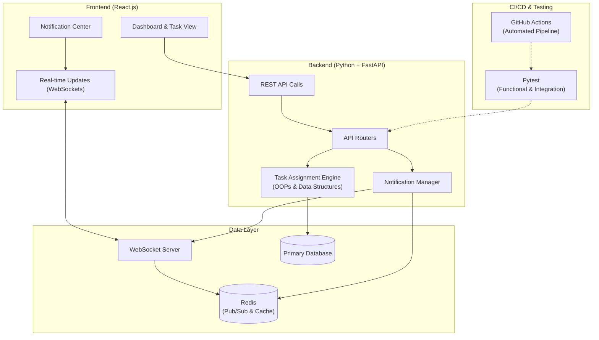

[<i class="fas fa-fw fa-link"></i> Live Site](https://www.orbitworkspace.xyz/) | [<i class="fab fa-fw fa-github"></i> View Source Code](https://github.com/chhayanshporwal/orbit-workspace)

**Summary:** An enterprise workspace collaboration platform designed for scalable real-time project and task management.

*   **Problem:** Enterprise teams require highly scalable backends and real-time synchronization to ensure seamless task management and instant notifications for all users without high latency.
*   **Solution:** Architected a live full-stack enterprise project management platform. Developed a scalable backend using Python and FastAPI, and built a dynamic React.js frontend that integrates real-time WebSockets and Redis for instant notifications and task tracking.
*   **Tech Stack:** Python, FastAPI, React.js, WebSockets, Redis, Pytest, GitHub Actions.
*   **Outcome:** Delivered a robust collaboration platform with comprehensive automated test scripts using Pytest across REST APIs and continuous integration pipelines via GitHub Actions.

### System Architecture

*   **What I learned:** Deepened expertise in architecting live, full-stack enterprise systems. Mastered real-time communication protocols using WebSockets and Redis, and strengthened testing and deployment practices with Pytest and GitHub Actions.
